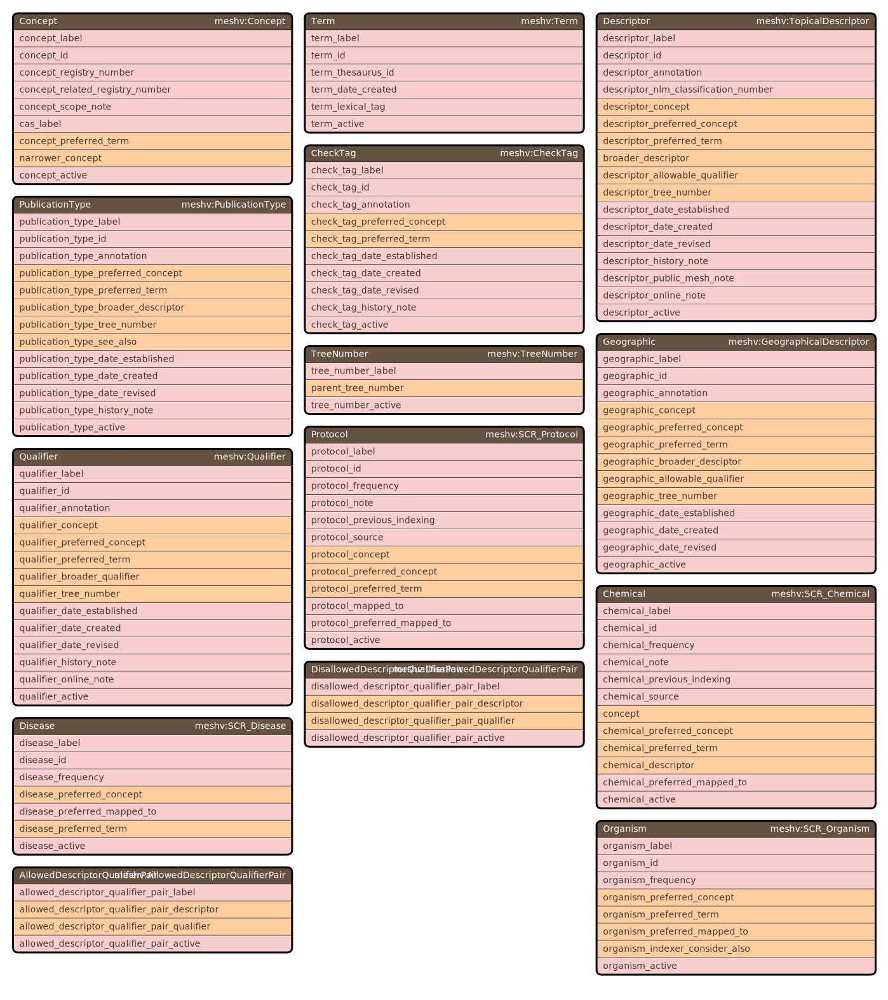
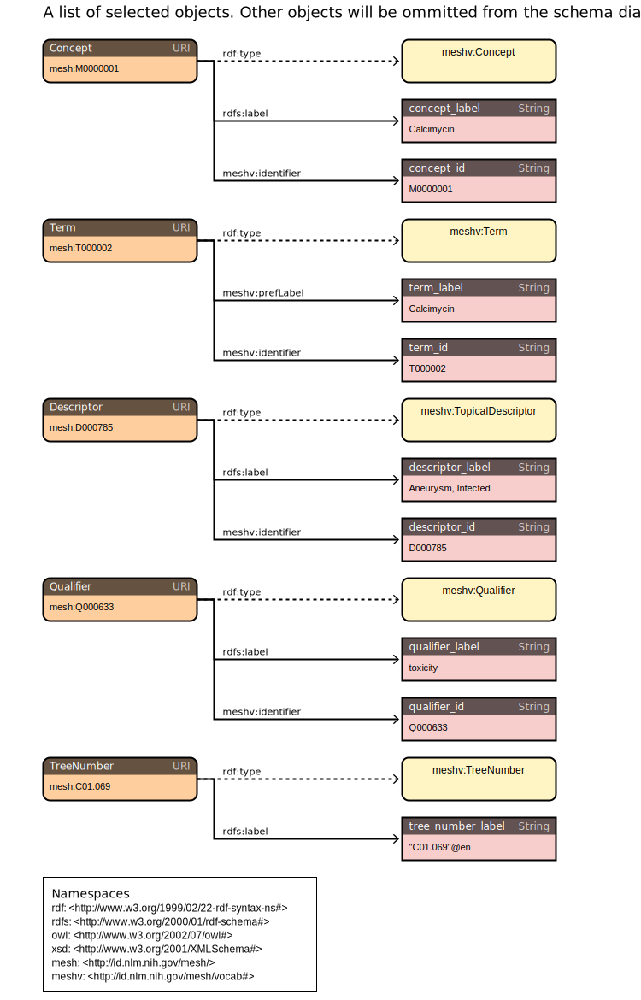
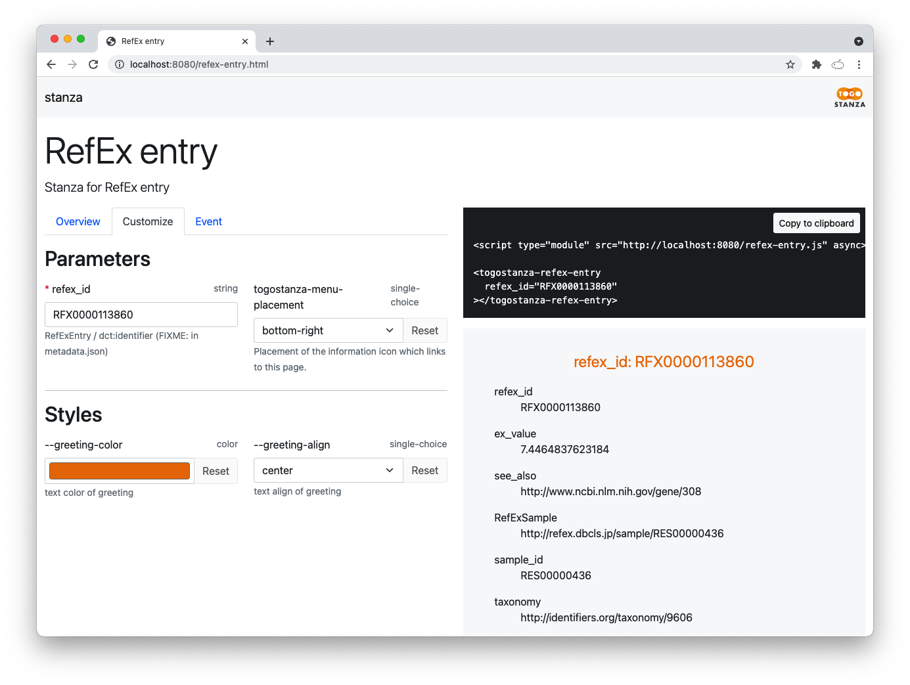

# RDF configの実行方法と実行オプション

## 実行方法

```
% rdf-config --config 設定ファイルのディレクトリ 実行オプション
```

--configオプションには、設定ファイルが保存されているディレクトリを指定する

## 実行オプション
| オプション | 実行される処理 |
----|----
| --sparql \[クエリ名\] | SPARQLクエリを標準出力に出力する。 |
| --query \[変数名 変数名=値\] | 出力する変数およびVALUESの値のリストを指定してSPARQLクエリを標準出力に出力する。 |
| --endpoint \[エンドポイント名\] | `--sparql`や`--query`で使用するエンドポイントを指定する。 |
| --url | `--sparql`や`--query`で生成したSPARQLをURLエンコードして出力する。 |
| --schema \[スキーマ名:図の種類\] | RDFモデルのスキーマ図をSVG形式で標準出力に出力する。 |
| --senbero | RDFモデルの構造をテキスト形式で標準出力に出力する。 |
| --stanza \[Stanza ID\] | JavaScript版のStanzaファイル一式を生成する。<br />Node.jsがインストールされており、<br />npxコマンドのディレクトリがPATH環境変数に設定されている必要がある。 |
| --grasp | Graspの設定ファイル（GraphQLのスキーマファイルとクエリファイル）を生成する。<br />Graspの設定ファイルは、カレントディレクトリ配下の「grasp/設定ファイルディレクトリ名」というディレクトリに生成される。 |
| --shex | ShExを標準出力に出力する。 |

### オプションごとの設定名の表示

#### `--sparql`

```
% rdf-config --config config/db --sparql
```

のようにオプションを省略することで、下記のように設定可能なクエリ名のリスト、デフォルト値の指定されている変数、およびエンドポイント名のリストが標準エラー出力に表示される。

```
Usage: --sparql query_name [--query var=value] [--endpoint endpoint_name]
Available SPARQL query names: SPARQLクエリ名1, SPARQLクエリ名2
Preset SPARQL query parameters (use --query to override):
  クエリ名1: 変数名1
  クエリ名2: 変数名2, 変数名3
Available SPARQL endpoint names: エンドポイント名1, エンドポイント名2
```

#### `--query`

```
% rdf-config --config config/db --query
```

のようにオプションを省略することで、ヘルプとエンドポイント名のリストが標準エラー出力に表示される。

```
Usage: --query var1 var2=value var3 [--endpoint endpoint_name]
  var: Specify a list of variable names (defined in the model.yaml file).
  var=value: Specify variable name and its value to be assigned.
Available SPARQL endpoint names: エンドポイント名1, エンドポイント名2
```

`--query` オプションには、`model.yaml` で定義されている任意の変数名のリストを渡すことができ、それらを出力するSPARQLクエリを生成する。変数名に `var=value` の形で値を指定すると、VALUES句で使用する値を指定（デフォルト値が `sparql.yaml` で定義されている場合は上書き）できる。

#### `--endpoint`

エンドポイントを指定する `--endpoint` オプションは `--sparql`, `--query`, `--stanza` と組み合わせて使用する。

```
% rdf-config --config config/db --endpoint
```

のようにオプションを省略することで、指定可能なエンドポイント名のリストが標準エラー出力に表示される（デフォルトは `endpoint`）。

```
Usage: --endpoint endpoint_name
Available SPARQL endpoint names: エンドポイント名1, エンドポイント名2
```

#### `--url`

URLエンコードしたSPARQLの出力を指定する `--url` オプションは `--sparql`, `--query`, `--stanza` と組み合わせて使用する。

```
% rdf-config --config config/db --sparql クエリ名 [--endpoint エンドポイント名] --url
% rdf-config --config config/db --query 変数名のリスト [--endpoint エンドポイント名] --url
```

#### `--schema`

`schema.yaml` が作られている場合、

```
% rdf-config --config config/db --schema
```

のようにオプションを省略することで、設定可能なスキーマ名のリストおよび指定可能な図の種類のリストが標準エラー出力に表示される。

```
Usage: --schema schema_name[:type]
Available schema names: スキーマ名1, スキーマ名2, スキーマ名3
Avanlable schema types: nest, table, arc
```

`schema.yaml` がない場合、デフォルトのスキーマ図が生成される。

#### `--stanza`

```
% rdf-config --config config/db --stanza
```

のようにオプションを省略することで、下記のように設定可能なスタンザ名のリストが標準エラー出力に表示される。

```
Usage: --stanza stanza_name
Available stanza names: スタンザ名1, スタンザ名2
```

### SPARQLの生成について

SPARQL を生成するには、rdf-config に --sparql オプションを付けて実行する。

```
% rdf-config --config 設定ファイルのディレクトリ名 --sparql クエリ名 [--endpoint エンドポイント名]
```

クエリ名には、`sparql.yaml` ファイルで設定したクエリを１つ選んで指定する。

エンドポイント名には、`endpoint.yaml` ファイルで設定したエンドポイントを１つ選んで指定する。

以下では、MeSH の [model.yaml](../config/mesh/model.yaml), [sparql.yaml](../config/mesh/sparql.yaml), [endpoint.yaml](../config/mesh/endpoint.yaml) を用いて実行例を示す。

例：MeSH の SPARQL 生成で、クエリ名 `sparql` を使用

```
% rdf-config --config config/mesh --sparql sparql
# Endpoint: https://id.nlm.nih.gov/mesh/sparql
# Description: Descriptor -> Concept -> Term, Descriptor -> Qualifier, Descriptor -> Term, Descriptor -> TreeNumber

PREFIX meshv: <http://id.nlm.nih.gov/mesh/vocab#>
PREFIX rdfs: <http://www.w3.org/2000/01/rdf-schema#>

SELECT ?descriptor_id ?descriptor_label ?concept_id ?concept_label ?term_id ?term_label ?qualifier_id ?qualifier_label ?tree_number_label
WHERE {
    ?Descriptor a meshv:TopicalDescriptor ;
        meshv:identifier ?descriptor_id ;
        rdfs:label ?descriptor_label ;
        meshv:concept / meshv:identifier ?concept_id ;
        meshv:concept / rdfs:label ?concept_label ;
        meshv:concept / meshv:preferredTerm / meshv:identifier ?term_id ;
        meshv:concept / meshv:preferredTerm / meshv:prefLabel ?term_label ;
        meshv:allowableQualifier / meshv:identifier ?qualifier_id ;
        meshv:allowableQualifier / rdfs:label ?qualifier_label ;
        meshv:treeNumber / rdfs:label ?tree_number_label .
}
LIMIT 100
```

例：クエリ名を `tree_pair` に、エンドポイント名を `med2rdf` に変更

```
% rdf-config --config config/mesh --sparql tree_pair --endpoint med2rdf
# Endpoint: http://sparql.med2rdf.org/sparql
# Description: 
# Parameter: parent_tree_number: (example: mesh:C01)

PREFIX meshv: <http://id.nlm.nih.gov/mesh/vocab#>
PREFIX mesh: <http://id.nlm.nih.gov/mesh/>

SELECT ?TreeNumber ?parent_tree_number
FROM <http://med2rdf.org/graph/mesh>
WHERE {
    VALUES ?parent_tree_number { mesh:C01 }
    ?TreeNumber a meshv:TreeNumber ;
        meshv:parentTreeNumber ?parent_tree_number .
    ?parent_tree_number a meshv:TreeNumber .
}
LIMIT 100
```

#### 変数に値を指定した SPARQL を生成する

`sparql.yaml` の parameters に指定されている変数に、デフォルト値以外の値を与えて SPARQL を生成する場合、`--query` オプションに「変数名=値」を追加する。

```
% rdf-config --config 設定ファイルのディレクトリ名 --sparql クエリ名 --endpoint エンドポイント名 --query 変数名=値 変数名2=値2
```

例：Ensembl で taxonomy ID をヒト (taxonomy:9606) からマウス (taxonomy:10090) に変更した SPARQL を生成

```
% rdf-config --config config/ensembl --sparql sparql --query ensg_taxonomy=taxonomy:10090
# Endpoint: https://integbio.jp/rdf/mirror/ebi/sparql
# Description: Ensembl gene and chromosome
# Parameter: ensg_taxonomy: (example: taxonomy:9606)

PREFIX obo: <http://purl.obolibrary.org/obo/>
PREFIX enso: <http://rdf.ebi.ac.uk/terms/ensembl/>
PREFIX dc: <http://purl.org/dc/elements/1.1/>
PREFIX rdfs: <http://www.w3.org/2000/01/rdf-schema#>
PREFIX faldo: <http://biohackathon.org/resource/faldo#>
PREFIX taxonomy: <http://identifiers.org/taxonomy/>

SELECT ?ensg_id ?ensg_label ?ensg_location ?ensg_taxonomy
FROM <http://rdf.ebi.ac.uk/dataset/ensembl/102/homo_sapiens>
WHERE {
    VALUES ?ensg_taxonomy { taxonomy:10090 }
    VALUES ?EnsemblGeneClass { obo:SO_0001217 enso:protein_coding }
    ?EnsemblGene a ?EnsemblGeneClass ;
        dc:identifier ?ensg_id ;
        rdfs:label ?ensg_label ;
        faldo:location ?ensg_location ;
        obo:RO_0002162 ?ensg_taxonomy .
}
LIMIT 100
```

#### 任意の変数を指定した SPARQL を生成する

`sparql.yaml` を利用せず、`model.yaml` に定義されている任意の変数名を列挙して SPARQL を生成する場合、`--query` オプションに「変数名1 変数名2」のようなリストを指定する。変数名に VALUES 句でバインドする値は「変数名=値」の形で指定する。

```
% rdf-config --config 設定ファイルのディレクトリ名 --query 変数名1 変数名2=値 変数名3 --endpoint エンドポイント名
```

例：HGNC で gene_id を指定し、hgnc_id, description, ensembl_id を取得する SPARQL を生成

```
% rdf-config --config config/hgnc --query gene_id=ACE2 hgnc_id description ensembl_id
# Endpoint: http://sparql.med2rdf.org/sparql
# Description: 
# Parameter: gene_id: (example: ACE2)

PREFIX obo: <http://purl.obolibrary.org/obo/>
PREFIX m2r: <http://med2rdf.org/ontology/med2rdf#>
PREFIX dct: <http://purl.org/dc/terms/>
PREFIX rdfs: <http://www.w3.org/2000/01/rdf-schema#>
PREFIX idt: <http://identifiers.org/>

SELECT ?hgnc_id ?description ?ensembl_id
WHERE {
    VALUES ?gene_id { "ACE2" }
    VALUES ?HGNC__class { obo:SO_0000704 m2r:Gene }
    ?HGNC a ?HGNC__class ;
        dct:identifier ?hgnc_id ;
        dct:description ?description ;
        rdfs:label ?gene_id .
    OPTIONAL {
        ?HGNC rdfs:seeAlso ?Ensembl .
        ?Ensembl a idt:ensembl ;
            dct:identifier ?ensembl_id .
    }
}
LIMIT 100
```

#### 生成したSPARQL を URL エンコードして結果を取得する

利用したい SPARQL が生成できることを確認したら、`--url` オプションを付けることで SPARQL 検索が実行可能な API の URL が出よくされるため、アプリケーションや `curl` コマンドなどで結果を取得する。

```
% curl -H 'Accept: application/sparql-results+json' `bin/rdf-config --config config/hgnc --query gene_id=ACE2 hgnc_id description ensembl_id --url`
{ "head": { "link": [], "vars": ["hgnc_id", "description", "ensembl_id"] },
  "results": { "distinct": false, "ordered": true, "bindings": [
    { "hgnc_id": { "type": "literal", "value": "13557" }	, "description": { "type": "literal", "value": "angiotensin converting enzyme 2" }	, "ensembl_id": { "type": "literal", "value": "ENSG00000130234" }},
    { "hgnc_id": { "type": "literal", "value": "13557" }	, "description": { "type": "literal", "value": "angiotensin converting enzyme 2" }	, "ensembl_id": { "type": "literal", "value": "ENSG00000130234" }} ] } }
```

### スキーマ図の生成について

スキーマ図を生成するには、rdf-config に --schema オプションを付けて実行する。

```
% rdf-config --config 設定ファイルのディレクトリ名 --schema スキーマ名:図の種類
```

図の種類には以下の3つの値を指定することができる。
- nest： ツリー構造のRDFスキーマ図が生成される。
- arc： 主語名が円周上に表示され、主語間で関係（主語が別の主語の目的語になっている）がベジエ曲線で結ばれた図が生成される。
- table： ER図のように、主語、述語、目的語がテーブル形式になった図が生成される。

図の種類が指定されていない場合は、各主語が1列に並んだ図が生成される。

スキーマ名には、`schema.yaml` ファイルで設定したスキーマ名を指定する。
スキーマ図に出力したい主語名、目的語名を `schema.yaml` ファイルに設定しておくことで、`model.yaml` ファイルに設定された全ての RDF トリプルではなく、スキーマ図のサブセットを生成することができる。

以下では、MeSH の [model.yaml](../config/mesh/model.yaml) と [schema.yaml](../config/mesh/schema.yaml) を用いて実行例を示す。

例：デフォルトで全ての主語と目的語を出力（タイトルは無し）

```
% rdf-config --config config/mesh --schema > mesh.svg
```


例：主語間の関係を arc で表示

```
% rdf-config --config config/mesh --schema :arc > mesh_arc.svg
```


例：各主語の目的語を表形式でコンパクトに表示

```
% rdf-config --config config/mesh --schema :table > mesh_table.svg
```


例：タイトルだけ追加したスキーマ図を生成

```
% rdf-config --config config/mesh --schema title > mesh_title.svg
```
* [mesh_title.svg](./figure/mesh_title.svg)

例：一部の主語だけを抜き出したスキーマ図を生成

```
% rdf-config --config config/mesh --schema main_subjects > mesh_main_subjects.svg
% rdf-config --config config/mesh --schema main_subjects:arc > mesh_main_subjects_arc.svg
% rdf-config --config config/mesh --schema main_subjects:table > mesh_main_subjects_table.svg
```
* [mesh_main_subjects.svg](./figure/mesh_main_subjects.svg)
* [mesh_main_subjects_arc.svg](./figure/mesh_main_subjects_arc.svg)
* [mesh_main_subjects_table.svg](./figure/mesh_main_subjects_table.svg)

例：一部の目的語だけを抜き出したスキーマ図を生成

```
% rdf-config --config config/mesh --schema main_objects > mesh_main_objectss.svg
% rdf-config --config config/mesh --schema main_objects:arc > mesh_main_objects_arc.svg
% rdf-config --config config/mesh --schema main_objects:table > mesh_main_objects_table.svg
```



### スタンザの生成について

スタンザを生成するには、rdf-config に --stanza オプションを付けて実行する。

```
% rdf-config --config 設定ファイルのディレクトリ名 --stanza スタンザ名
```

生成されるスタンザは `stanza.yaml` で指定した `output_dir` に出力される。

例：RefEx のスタンザを生成

```
% rdf-config --config config/refex --stanza refex_entry
Generate stanza: refex_entry
Execute command: npx togostanza generate stanza refex_entry --label "RefEx entry" --definition "Stanza for RefEx entry"
? license (MIT):   # ← ライセンスを指定、リターンでデフォルトの MIT が選択される
? author (dbcls):  # ← 作成者名を指定
   create stanzas/refex-entry/README.md
   create stanzas/refex-entry/index.js
   create stanzas/refex-entry/style.scss
   create stanzas/refex-entry/assets/.keep
   create stanzas/refex-entry/templates/stanza.html.hbs

Stanza template has been generated successfully.
To view the stanza, run (cd stanza; npx togostanza serve) and open http://localhost:8080/
```

このあと、表示されている通りコマンドを実行し、

```
% cd stanza
% npx togostanza serve
```

ブラウザで http://localhost:8080/ 表示して確認する。



表示が確認できたら、生成されたスタンザを改変しカスタマイズなどを行う。

```
stanza/stanzas/refex-entry
|-- README.md
|-- assets                 # ← 表示に用いる追加の画像や静的ファイルはここに設置
|-- index.js               # ← 機能の追加は JavaScript ファイルを修正
|-- metadata.json          # ← メタデータは JSON ファイルを修正
|-- style.scss             # ← デザインの変更は CSS ファイルを修正
`-- templates
    |-- stanza.html.hbs    # ← 表示方法の変更は HTML ファイルを修正
    `-- stanza.rq.hbs      # ← クエリの改訂は SPARQL ファイルを修正
```


